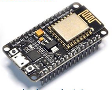
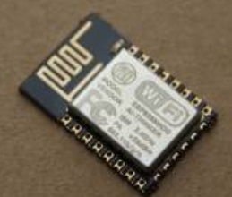
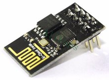
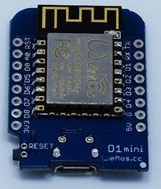
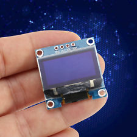

## P-Suite

An integrated suite of micropython files for ESP8266. Intended to work in due course with ESP32 also.

## Overview:

This suite of files is intended primarily for use with ESP12-based
boards (including NodeMCU and Wemos D1-mini), but it does work for
ESP-01, within its gpio limits. pSuite is modelled on the earlier eLua [eSuite](https://github.com/BLavery/esuite-lua).

pSuite automates the standard startup including escape time, wifi connection and time
setting. This leaves you to concentrate just on your project scripting: on exactly
what you want to control. Included is a collection of drop-in library
files for many common devices. The library files are generally fairly
practical and needing minimal configuration in your project.

The pSuite projects are intended to be used as client (“STATION” mode)
in conjunction with a nearby wifi access point. The ESP8266 is a
wifi-capable chip, and merely using an isolated “blink a LED” project
misses its point!

The micropython environment uses the SOC native numbers for GPIO pins (0 1 ... 16). This is the chip's native GPIO numbering as used also by the arduino-esp environment. You may need to cross reference from the D0 D1 labelling seen on nodemcu devkit boards.

## Disclaimer/Claimer:

As at October 2017, this project is merely "bare-bones". Please consider it as 0.1 alpha. However, it DOES run.

It is groundwork for a proposed class starting in 2018. My classes tend to prefer interpreter environments rather than compiler. The nodemcu eLua interpreter based on the "non-OS" SDK has occupied this position for ESP8266 until now. It has been stable, well documented and effective.

For the ESP32, there are currently at least 3 lua development attempts "out there". Espressif has terminated the "non-OS" SDK used by the original "nodemcu" lua, and is now offering only the free-rtos SDK (a much better long-view choice). I can't find a lua worth using, or usably documented. I am suspecting the wind is out of the lua sails.

I believe the interpreter future is micropython. The ESP8266 micropython has reached workable status, and its documentation is reasonable if not quite finished. 

The ESP32 micropython build is published for trying, but clearly a lot of work remains. It seems to be undocumented, but I am hoping it is a fairly faithful clone of the ESP8266 version. It is missing some functions (eg RTC), and has debug traces all over. At the moment (Oct 2017) I am hoping on the two micropython builds to be a good foundation for a 2018 IoT class! ESP8266 - a surety, ESP32 - let's see.

And faux-python is a lot more mainstream than lua. And more student friendly than faux-arduino faux-C++ or hardcore IDE/rtos C.

## Common startup files:

1. boot.py
1. main.py
1. wifi.py
1. sntp.py
1. settings.py

These are always used. boot.py and main.py are as mandated by micropython. main.py imports wifi and sntp to start comunication and fetch real time. 
main then passes control to
your individual “project” file. So the standard minimum is five files, plus your project.

The compulsory **settings.py** is intended as a general-purpose config file easily importable by other modules. It includes your wifi credentials, i2c pin choice, blynk token, etc. And importantly, you **edit and re-upload the settings file to designate a new project file**.

**boot.py** simply ensures wifi has enabled auto-reconnect to your wifi router/AP.

**main.py** turns on for 2 seconds the led inbuilt to the ESP12 submodule. At the end of that period, the flash button ("D3" / gpio-0) is sampled. If pressed, processing terminates there. This gives you an escape mechanism in the case a script error is causing repeated reboots.

main.py then calls **wifi.py**. If your settings have nominated an AP mode password, then the ESP8266 AP server will start up on 192.168.4.1.  

If wifi has by now auto-connected as client to your local network, there is nothing more to do. Otherwise, each router credential listed in settings.py (and provided it is seen in a scan) will be tried for login. Its IP will display to terminal.

wifi.py finishes by starting webrepl on the network(s) active.

Then main.py calls **sntp.py**, which makes as many as 4 attempts to fetch internet time. You nominate in your settings file two ntp servers to use.

This library sets a 3-hour repeating timer for the time-sync operation, correcting any RTC drift of the ESP8266.

Finally, you are left with a useful asctime() function (readable timestamp) callable anytime with import snpt t=sntp.asctime().

main.py has one more job: to launch your nominated **project file**, which you nominate in the settings file. Obviously you must build your own project file(s), but any of the examples files could be a starting point.

## Blynk Library:

On micropython, a key consideration is shortage of RAM memory, and blynk needs a large and complex library. There is however a blynk library included here in pSuite.

[For the blynk API see HERE.](pblynk.md)

## Oled library:

In the classrom environment where eSuite & pSuite are targetted, 
an oled display is commonly used, usually the 128x64 "0.96 inch" ubiquitous module. It is easy, cheap and versatile.

**oled.py** is a wrapper to the usual sd1306.py module for ESP8266/ESP32. If an I2C scan shows oled is present, it initialises the display and presents initial info on IP number and time.  Thereafter, you use oled calls as per the framebuf documentation. 

## "Build" and IDE?

The options for communicating with your micropython ESP are:

1.  uPyCraft on Windows - not featured, temperamental
1.  AMPY cli from Adafruit - I found some commands crashed
1.  rshell cli
1.  mpfshell cli - similar to AMPY and my preference for CLI
1.  Browser based using webrepl interface
1.  uPyLoader - **my choice**, altho no folder support at MCU

The executable I use for uPyLoader (linux version) is here on /IDE folder.

The ESP8266 micropython binary I fetched direct from micropython website. The bin I used is here in the /bin folder.

You need recent esptool.py to flash the binary to the board. There is a copy here in /bin folder.

In all cases you ought to fetch your own copies of these tools.

uPyLoader IDE supports folders at PC end but not at the ESP end. So while "library" files in this repository can happily live in a /lib folder at PC, upload them all in together into the base folder at the ESP. Same applies to your selection of "project" files.
