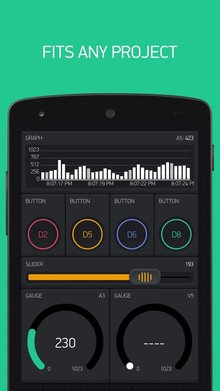

# P-Blynk   

# MicroPython Blynk library for ESP8266

## Intro

A single py file for blynk is too large to load in the ESP8266 available memory. It's the initial loading process that uses most memory, and the bytecode itself once loaded is (just) workable in the memory available. I have tried to use the mpy-cross compiler to convert it to mpy bytecode, so far without success. I find certain syntax constructions that run in py code fail in mpy code. There may be a solution, but I haven't found it yet.

So the blynk library in pSuite is in py file(s) and is loaded in stages. You import pblynk.py and that chains to several files blynk_1.py, blynk_2.py etc automatically. The code is a crude stitch-together that does actually work. 

On your APP, use **ESP8288 device type**. GPIO numbers are native chip GPIO references, not D0 D1 etc as labelled on some boards.

## Creating a blynk object

Your blynk token should be edited in your settings.py file.There are also 3 blynk options in settings:

-   BlynkBridge
-   BlynkExtras
-   BlynkGpioAuto. 

These if True will add extra
functionality to Blynk, at the expence of precious RAM memory. These same settings
can be overridden in project file before you import blynk.

Normal startup:
	import pblynk 
	b = pblynk.Blynk()  
- connection is TCP (no ssl option)

Adding options:

	import settings
	settings.BlynkGpioAuto=True
	import pblynk 
	b = pblynk.Blynk()  

At this point an instance is created, but it has **not** tried to connect to the Blynk cloud.  
That is done with b.run(), which needs to be last line of script.
b.run() is a **blocking function**, and does NOT return to your script. 

 
## GPIO control with zero coding

b.gpio_auto(Pull)   where Pull = Pin.PULL_UP or is omitted.
This causes all GPIOs that the phone APP is configured for will be 
automatically configured as inputs or outputs on the ESP8266. And GPIO
writes or reads (polls) issued by the APP will be handled at the ESP
without explicit coding. This function must be pre-optioned as above before importing blynk. 

The optional resistor pullup will apply to ALL the gpio autoconfigured as inputs.
 
Note that in many practical cases this will not be adequate, and custom coding is needed instead, as below. 

## GPIO & Virtual Read & Write Callbacks

The callbacks are like this, and should be def'd before doing the add_xxx_pin():

def digital_read_callback(pin, state):  
    digital_value = xxx       # access your hardware  
    return digital_value  -  or None (and then your own code should do the wanted write()    
           but the "correct" way is to "return" the value to APP  
    
def digital_write_callback(value, pin, state):  
    # access the necessary digital output and write the value  
    return    

   
def virtual_read_callback(pin, state):  
    virtual_value = 'Anything'       # access your hardware  
    return virtual_value         return may be None, or a single value, or a list of values (eg for LCD)  
           if using return None, then arrange own write back to APP,  
           but the "correct" way is to "return" the value to APP 
            
def virtual_write_callback(value, pin, state):  
    NOTE: "value" is a LIST, so you need to unpack eg value[0] etc  
    # access the necessary virtual output and write the value
    return
    
b.add_digital_hw_pin(pin=pin_number, read=digital_read_callback, inital_state=None)  
b.add_digital_hw_pin(pin=pin_number, write=digital_write_callback, inital_state=None)  
b.add_virtual_pin(vpin_number, read=virtual_read_callback, inital_state=None)  
b.add_virtual_pin(vpin_number, write=virtual_write_callback, inital_state=None)  
    in this context, write means "APP writes to HW" and read is "APP polls HW expecting HW reply"

initial_state is an optional payload of one value   
    That one value may possibly be a LIST of values if you want to pass several  
gpio  pins are actual GPIO pin numbers   
virtual pins are 0 - 127

## User Tasks:

It is possible to set up one periodic user task known as the Ticker. This is a function call from Blynk back to your project script. It is NOT a concurrent or threaded task.

  
Ticker is a repeating function - callback suspends blynk until its return  
    Register and start (one only) simple "ticker" function callback.  
    "divider" (default 40) divides into 200 to give ticker frequency. eg divider 100 gives 2 ticks / sec.  
    Ticker should exit promptly to not hold up blynk.  
    (eg 3 mSec would be considered quite too long.)

      
def ticker_callback(state):  
    # do anything you like  
    return new_state   or just return

b.Ticker(ticker_callback, divider=40, initial_state = None)  
b.Ticker(None) - disables
    

## Software widgets at python end:

b.lcd_cls(vpinnumber)  
b.lcd_print(vpinnumberx, y, message)   x=0-15   y=0-1
 
bridge = b.bridge_widget(my_vpin_number)   - all writes to this widget get bridged to other HW  
   bridge.set_auth_token(target_token)  - but first wait until "connected" !  
   bridge.virtual_write(target_vpin, val)   val = single param only, no lists  
   bridge.digital_write(target_gpiopin, val) 

b.notify(message_text)  
b.email([to,] subject, body)  
b.tweet(message_text)  
b.virtual_write(vpin_number, value)   value = either single value (int/str) or list of values.  
       For ad-hoc writing to a vpin (ie toward APP),  
       without necessarily having done add_virtual_pin()  
b.set_property(vpin, property, value)    eg "color", "#ED9D00"    or "label"/"labels" "onLabel" etc  
b.on_connect(connect_callback)  
b.on_disconnect(disconnect_callback)  
b.connect()  
b.disconnect()

b.run()   -  the main non-returning loop of the blynk engine.  Last line of python script.

https://github.com/BLavery/psuite-upython/blob/master/pblynk.md  

This blynk is hacked down from PiBlynk: see https://github.com/BLavery/PiBlynk
